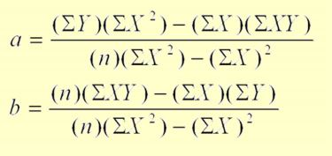
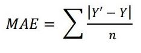
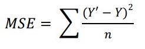
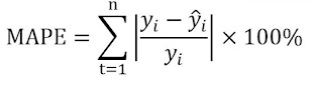

# Predictive Mining for Time Series Transaction Data
There are several methods for time series data prediction, one of which is linear regression. And the method that we will use for this experiment is linear regression. The dataset used is transaction data,
Regression is a measuring tool used to determine whether
there is a correlation between variables
• Regression analysis is more accurate in correlation analysis
because the rate of change of a variable against other
variables can be determined. So in regression, forecasting or
estimating the value of the dependent variable on the
independent variable is more accurate
• Linear regression is a regression where the independent
variable (variable X) has the highest rank of one. for simple
regression, i.e. linear regression which only involves 2
variables (variables X and Y)

Here is the formula for linear regression:
Y = a + (b*x)

Where :

Y= dependent variable

X = independent variable

a = intercept

b = slope(regression coefficient)

  

To test / evaluate the accuracy of the prediction results, we use MAE, MSE, and MAPE.
- MAE (Mean Absolute Error)
MAE or Mean Absolute Error shows the average error value which is an error from the actual value with the predicted value. MAE itself is generally used to measure error prediction in time series analysis. The formula for MAE itself is defined as follows:

  

Where :
Y' = Predicted Value
Y = True Value
n = Number of Data

- MSE (Mean Squared Error)
To calculate the MSE value is the same as the RMSE. Just don't use the root process. At this stage, if the error value is greater, the higher the MSE value is generated.

  

Where :
Y' = Predicted Value
Y = True Value
n = Number of Data

- MAPE (Mean Percentage Absolute Error)
The formula of the MAPE formula itself is as follows;

  

Where :
Y' = Predicted Value
Y = True Value
